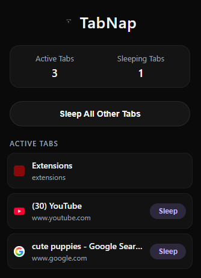
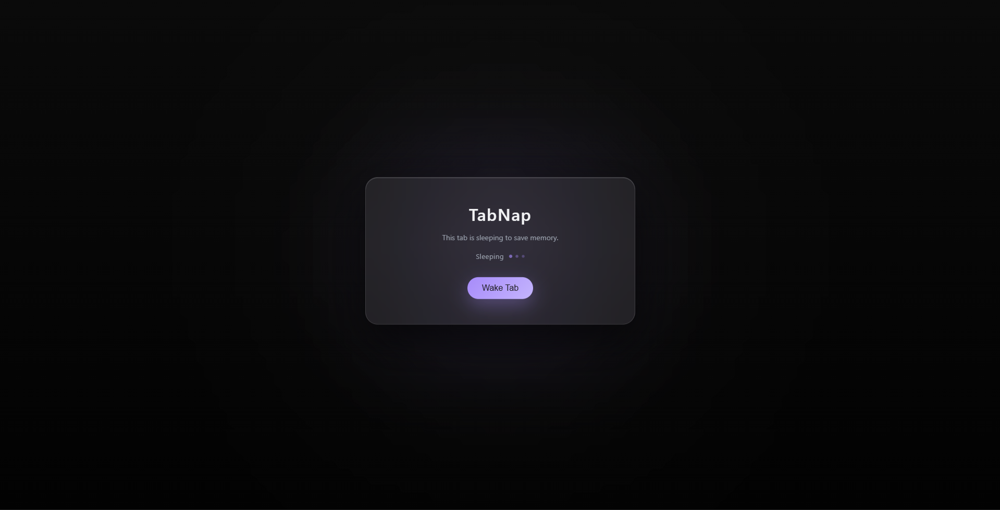

# TabNap 💤

**TabNap** is a lightweight Chrome extension that intelligently puts inactive browser tabs to sleep, helping reduce memory usage and improve browser performance.

Instead of keeping dozens of heavy tabs active, TabNap replaces inactive tabs with a beautiful glass-style sleep screen and restores them instantly when needed.

---

# ✨ Features

### Smart Tab Sleeping

Manually put tabs to sleep to save RAM and CPU usage.

### Wake Tabs Instantly

Restore a sleeping tab with a single click.

### Sleep All Other Tabs

Quickly hibernate all background tabs while keeping your current tab active.

### Active / Sleeping Tab Stats

The popup shows a live count of active and sleeping tabs.

### Premium UI

* Glassmorphism design
* Apple-inspired minimal interface
* Smooth animations and micro-interactions

---

# 📷 Dashboard Preview

## Main Extension Popup



---

## Sleeping Tab Screen



---

# ⚙️ How It Works

When a tab is put to sleep, TabNap replaces its content with a lightweight **sleep page**.

This page stores the original URL and restores it when the user clicks **Wake Tab**.

This approach frees memory from inactive tabs without losing the browsing session.

---

# 🧠 Why TabNap?

Modern browsing sessions often involve **20–100 open tabs**, which consume large amounts of memory.

TabNap solves this problem by:

* freeing unused resources
* keeping your workflow intact
* allowing instant tab restoration

---

# 🧱 Project Architecture

```
Chrome Browser
      │
      ▼
TabNap Extension
      │
      ├── Popup Interface
      │      │
      │      └── Lists active tabs
      │
      ├── Tab Manager Logic
      │      │
      │      └── Chrome Tabs API
      │
      └── Sleep Page
             │
             └── Restores original URL
```

---

# 🛠 Tech Stack

**Frontend**

* HTML
* CSS (Glassmorphism UI)
* JavaScript

**Chrome APIs**

* `chrome.tabs`
* `chrome.storage`

**Extension Format**

* Chrome Extension Manifest V3

---

# 📁 Project Structure

```
tabnap/
│
├── manifest.json
├── popup.html
├── popup.js
├── sleep.html
├── sleep.js
├── styles.css
│
├── icons/
│   └── icon.png
│
└── screenshots/
    ├── popup.png
    └── main.png
```

---

# 🚀 Installation (Local Development)

### 1 Clone the Repository

```
git clone https://github.com/your-username/tabnap.git
```

### 2 Open Chrome Extensions

```
chrome://extensions
```

### 3 Enable Developer Mode

Toggle **Developer Mode** in the top right.

### 4 Load the Extension

Click **Load Unpacked** and select the `tabnap` folder.

The extension will now appear in your Chrome toolbar.

---

# 🧪 Usage

1. Click the **TabNap icon** in the Chrome toolbar.
2. View your currently open tabs.
3. Click **Sleep** on any tab to hibernate it.
4. Click **Wake Tab** to restore the original page.

---

# 🔮 Future Improvements

Possible enhancements:

* Automatic sleep timer
* Memory usage detection
* Tab grouping
* Keyboard shortcuts
* Tab history
* Smart AI tab management

---

# 👨‍💻 Author

**Pratham Debnath**

BCA Graduate → MCA @ SRM University
Aspiring Software Engineer 

---

# ⭐ Support

If you like this project, consider giving it a **star on GitHub**.

It helps others discover the project and motivates further development.

---
